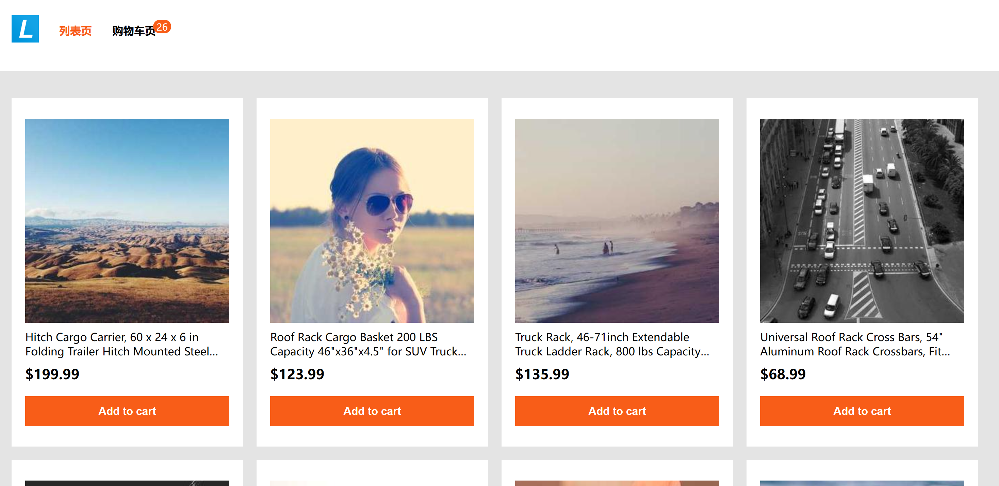
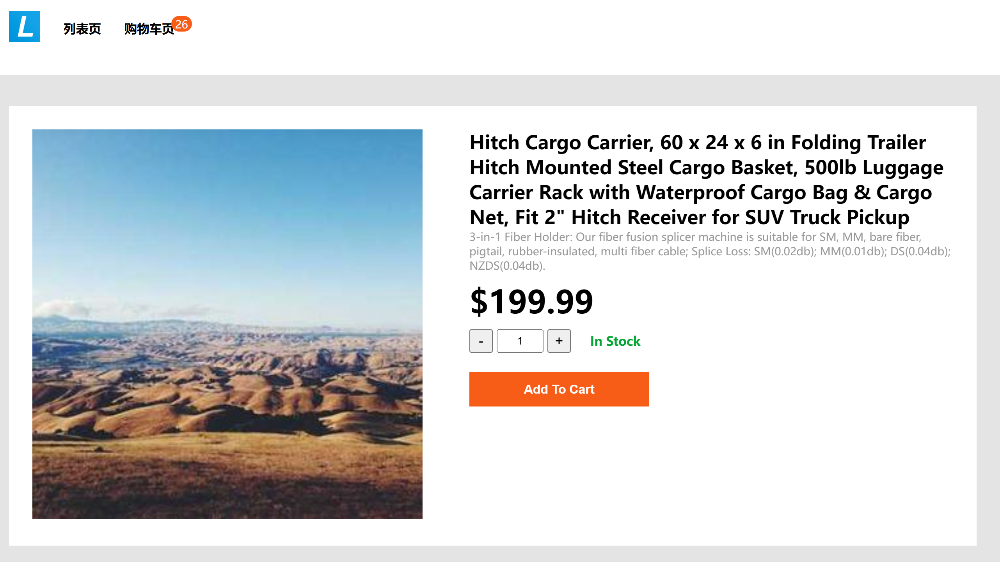
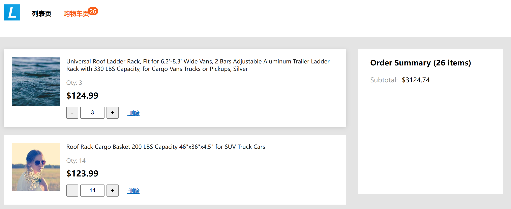
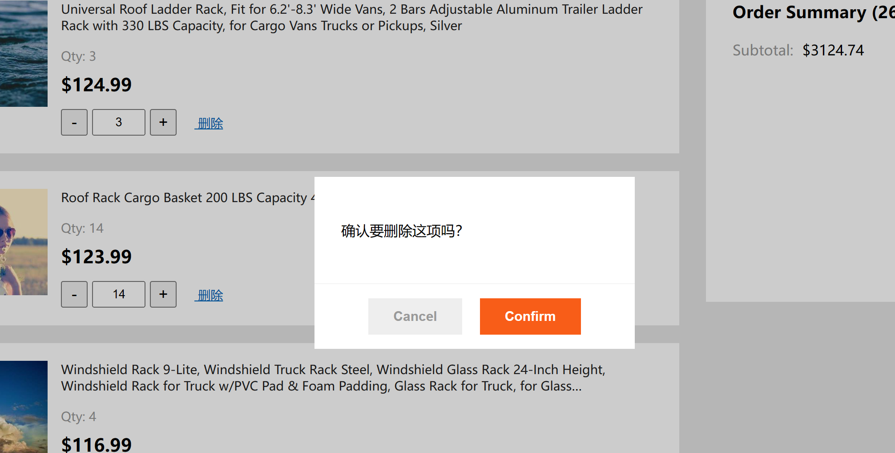

# vue2 商城小试牛刀

> 用于掌握基本的 vue2 用法

### 涵盖的知识点

-   vite 配置 vue2 项目
-   组件封装
-   插件封装
-   vuex 使用
-   vue-router 使用
-   createElement 使用
-   v-model 使用
-   emit 和 on 使用
-   Vue.extend 使用

### 页面截图

### 封装的组件

-   (通用)按钮 Button
-   (通用)加减器 InputNumber
-   (业务)商品卡片 GoodsCard
-   (业务)头部 Header
-   (业务)底部 Footer
-   (业务)推荐位 RecommendList

### 封装的插件

-   消息提示 $toast
-   确认弹窗 $confirm
-   四则运算
    -   $calc.add
    -   $calc.sub
    -   $calc.mult
    -   $calc.divide
